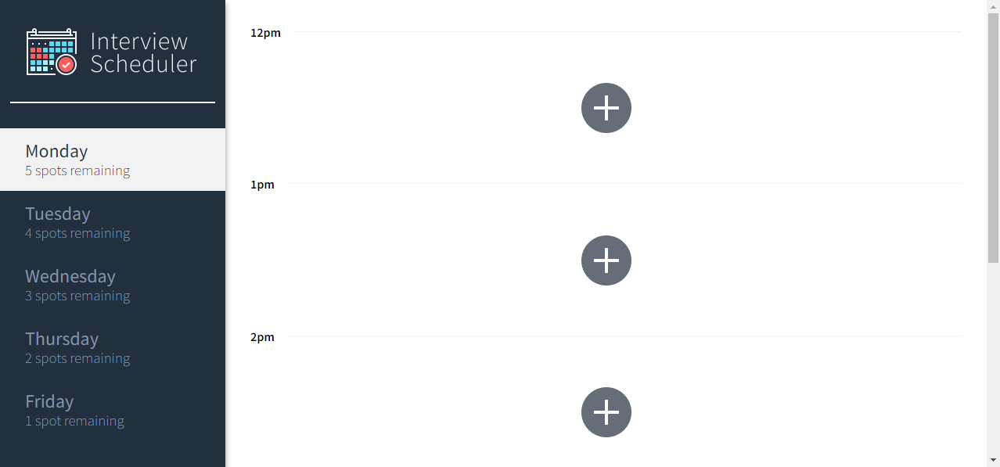
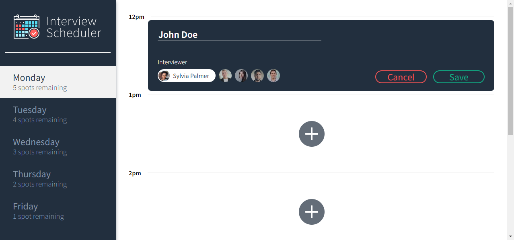
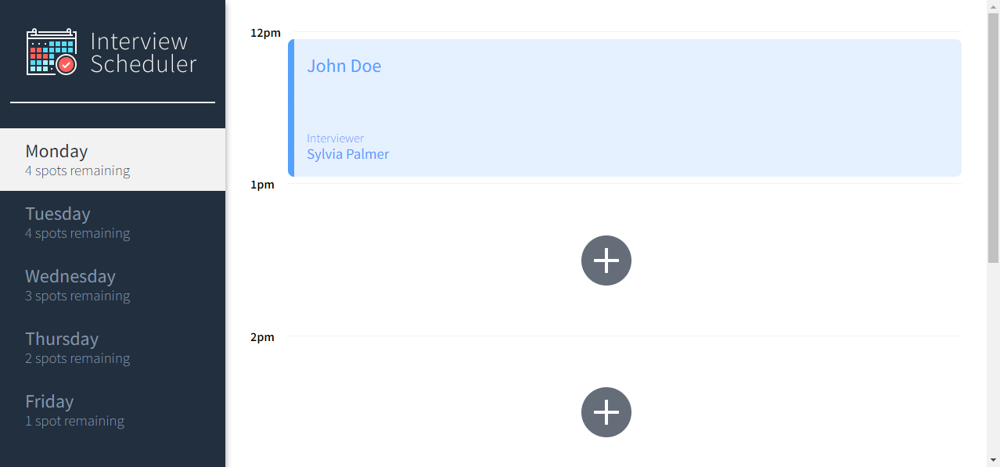
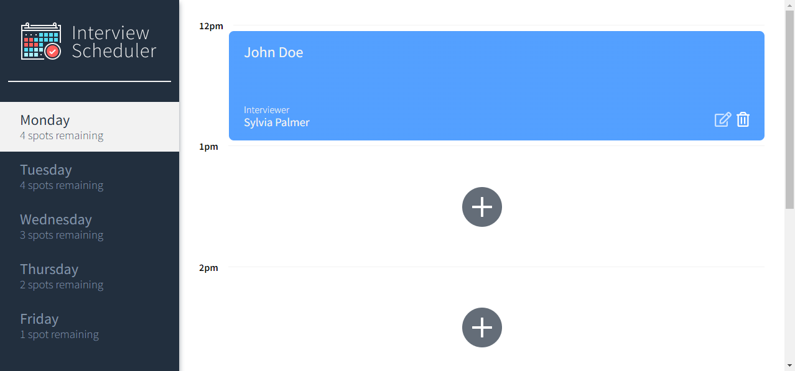
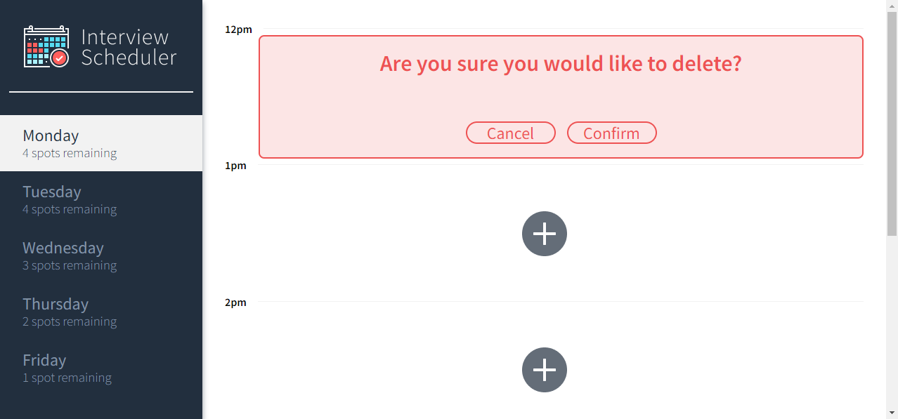

# Interview Scheduler

A React-based app for managing student-instructor interviews for a single week.

## Setup
### Database Setup
1. You will need PostgreSQL to use this application; please ensure that it is installed. If not, you can download PostGreSQL [here](https://www.postgresql.org/about/).
2. Start PostgreSQL: `psql` - please note that if you are on WSL, you will need to use the following command first: `startposgresql`.
3. Clone the database repo: `git clone git@github.com:Desyn6/scheduler-api.git`.
4. Follow the instructions in the packaged README.md file.

### Main App
1. Clone this repo: `git clone git@github.com:Desyn6/scheduler.git`.
Install dependencies with `npm install`.
2. Run the app using the command `npm start`.
3. Access the app at `http://localhost:8000/`.
4. Should you ever need to reset the database, make a GET request to `http://localhost:8001/api/debug/reset`.

## Features

### Selecting Days
1. The available days are shown on the left navbar - click the day you wish to add/edit/delete interviews for. 
2. The day list will also show the number of free spots remaining - this is updated automatically as interviews are added or deleted.

### Adding Interviews
1. Click the '+' button on the root directory.
2. Type in a student name.
3. Select an interviewer from the list.
4. Click the 'Save' button.

### Editing Interviews
1. Mouse hover over a booked interview.
2. Click the 'Edit' button - this is the pencil on paper icon.
3. Change the student name as required.
4. Select a new interviewer as required. 
5. Click the 'Save' button.

### Deleting Interviews
1. Mouse hover over a booked interview.
2. Click the 'Delete' button - this is a garbage can icon.
3. Click the 'Confirm' button.

## Environment
- Node v12.22.7 or higher

## Dependencies
- axios 0.20.0 or above
- classnames 2.2.6 or above
- normalize.css 8.0.1 or above
- react 16.9.0 or above
- react-dom 16.9.0 or above
- react-scripts 3.4.4. or above

## Interface Images

